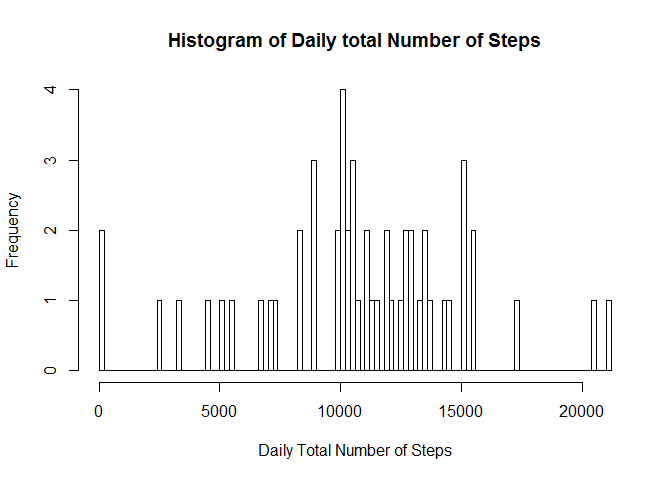
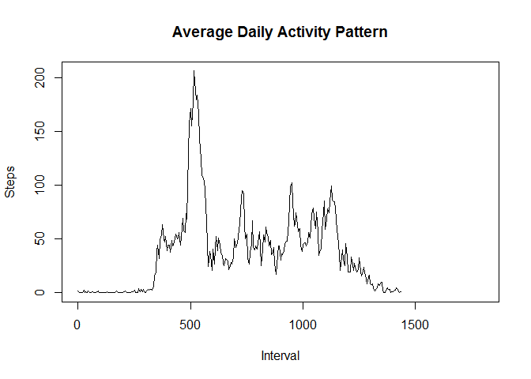
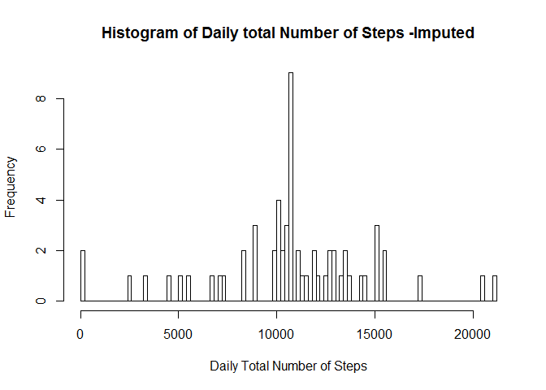
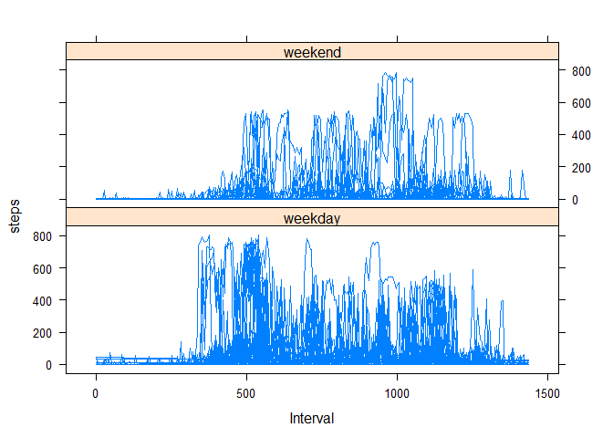

# Reproducible Research: Peer Assessment 1
## Set Global Option "Echo=True"


```r
library(knitr)
```

```
## Warning: package 'knitr' was built under R version 3.1.2
```

```r
opts_chunk$set(echo="True")
```

## Loading and preprocessing the data

```r
setwd("C:/Users/Kaushik/Reproduce1/repdata-data-activity")
data<-read.csv("activity.csv",sep=",",header=T)
```


## What is mean total number of steps taken per day?


```r
agr_data<-aggregate(steps~date,data,sum,na.rm=T)
hist(agr_data$steps,main="Histogram of Daily total Number of Steps",xlab="Daily Total Number of Steps",breaks=100)
```

 

```r
meanstep<-mean(agr_data$steps)
medianstep<-median(agr_data$steps)
```
Mean Total Number of Steps taken each day = 1.0766189\times 10^{4}  
Median Total Number of Steps taken each day = 10765

## What is the average daily activity pattern?
For deriving average daily activity pattern , the code below run the 
aggregate function to determine the mean number of steps per interval and then plots a histogram that will give the average daily activity pattern.


```r
data$upd_interval <- 60 * (as.integer(data$interval/100)) + (data$interval %% 100)

agr_data<-aggregate(steps~upd_interval,data,mean,na.rm=T)

with(agr_data,plot(upd_interval,steps,type="l",xlim=c(1,1800),xlab="Interval",ylab="Steps",main="Average Daily Activity Pattern"))
```

 

```r
x<-which(agr_data$steps ==max(agr_data$steps))
x
```

```
## [1] 104
```

104th interval, on average across all the days in the dataset, contains the maximum number of steps

## Imputing missing values

```r
Total_NA <-sum(is.na(data$steps))
```
The total number of missing values in the dataset is 2304

The below code snippets create a new dataset after copying from the original data set and then fill out all the missing values with the overall mean of the corresponding 5-minute interval that contains the missing value. 


```r
new_data <-data
agr_data<-aggregate(steps~interval,new_data,mean)
for (i in 1:17568){

if (is.na(new_data$steps[i])) {
  new_data$steps[i] <-agr_data$steps[match(new_data$interval[i],agr_data$interval)] 
}
else {
  new_data$steps[i]=new_data$steps[i]
}
}
new_agr_data<-aggregate(steps~date,new_data,sum)
hist(new_agr_data$steps,main="Histogram of Daily total Number of Steps -Imputed",xlab="Daily Total Number of Steps",breaks=100)
```

 

```r
new_meanstep<-mean(new_agr_data$steps)
new_medianstep<-median(new_agr_data$steps)
mean_diff <- (meanstep - new_meanstep)
median_diff <- (medianstep - new_medianstep)
```
New Mean Total Number of Steps taken each day after Imputing NA values = 1.0766189\times 10^{4}  
New Median Total Number of Steps taken each day after Imputing NA values = 1.0766189\times 10^{4}  
Differences in Mean Total Number of Steps between Non-Imputed and Imputed Data = 0   
Differences in Median Total Number of Steps between Non-Imputed and Imputed Data = -1.1886792


## Are there differences in activity patterns between weekdays and weekends?

For this part of assignment , the imputed data with all the missing data filled in has been used. 
The code snippets below first identify the day of the week by using the "weekdays()" function on the date column. 

After identifying the day of the week the datset is divided into two separate datasets - one that contains all weekday data and another that contains only the weekend data.

For the sake of this assignment , US weekend standards are followed (i.e. Saturday and Sunday are considered weekend)


```r
new_data$day<-weekdays(as.Date(new_data$date))
class(new_data$day) <- c("character")

for (i in 1:17568){
if (new_data$day[i] %in% c("Monday","Tuesday","Wednesday","Thursday","Friday")){
  new_data$day1[i]<-c("weekday")
}
else{
  new_data$day1[i]<-c("weekend")
}
}
new_data$day1 <- as.factor(new_data$day1)
new_data$upd_interval <- 60 * (as.integer(new_data$interval/100)) + (new_data$interval %% 100)


library(lattice)
```

```
## Warning: package 'lattice' was built under R version 3.1.2
```

```r
xyplot(steps ~ upd_interval | day1,data=new_data,layout=c(1,2),type="l",xlab="Interval")
```

 
Weekend has more consistent peaks than weekdays , even though weekdays seems the activity peak is higher , but the inconsistency in the data , it can be concluded that due to in weekdays people are generally gets time for the activity during a specific duration , but in weekend people can spend more consistent time on the activities.
